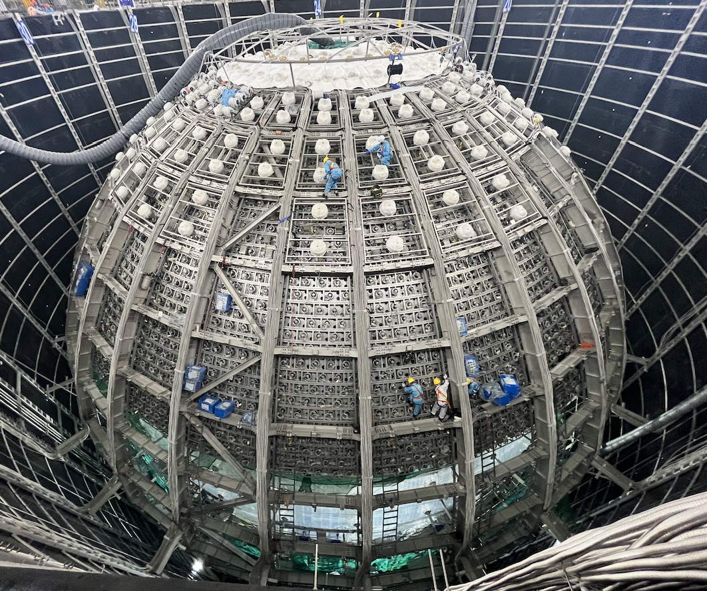



## Jiangmen Underground Neutrino Observatory (developing..)
* JUNO under construction in June 2023 

* Introduction

* Study of Supernova in the Era of Multi-Messenger Astronomy

* Diffuse Supernova Neutrino Background (or Supernova Relic Neutrinos)

